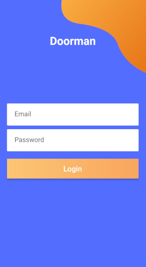
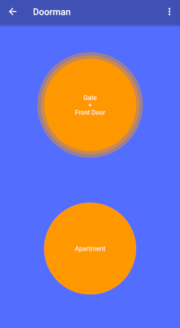

# Doorman

This is a door opener app.
Since it is written in Flutter, it works in IOS, Android, and on the web.

The server side project is [in a separate repository](https://github.com/knipknap/doorman-hub).

# Installation

You can just install it from the [Google Play Store](https://play.google.com/store/apps/details?id=com.bb.doorman).
